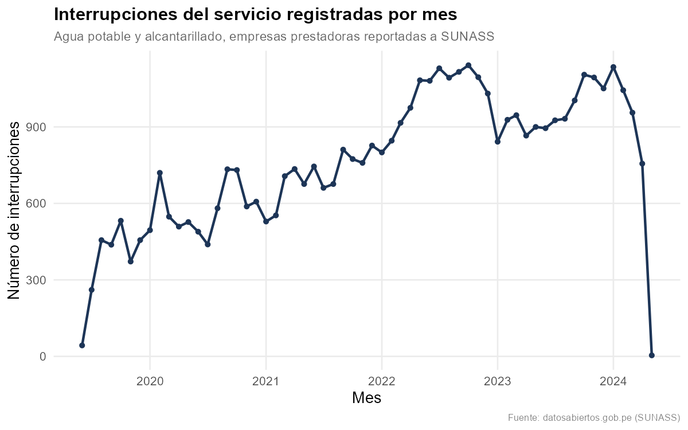
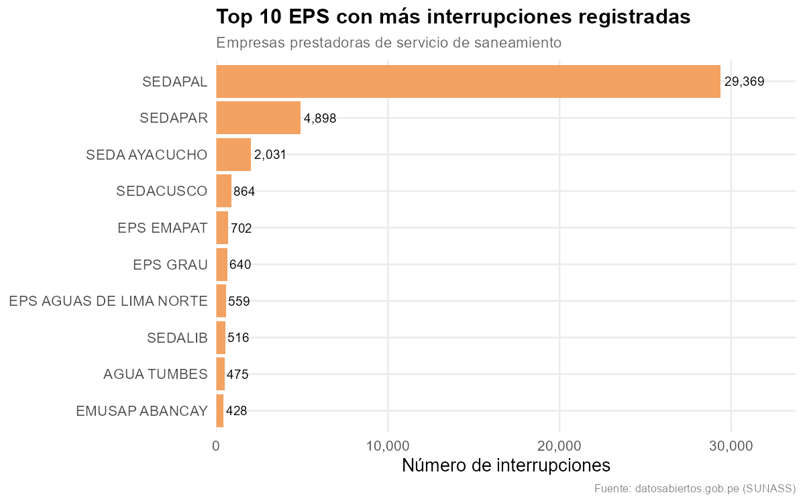
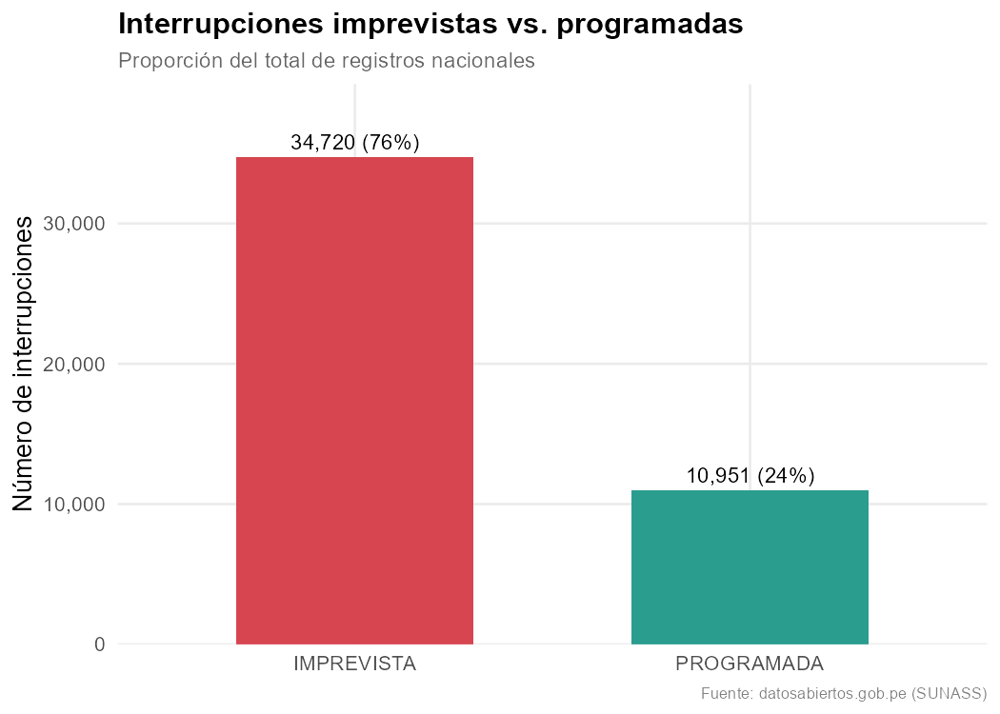
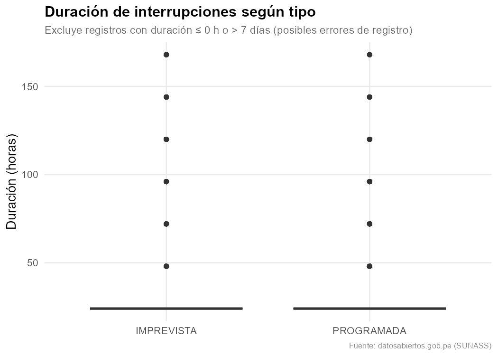
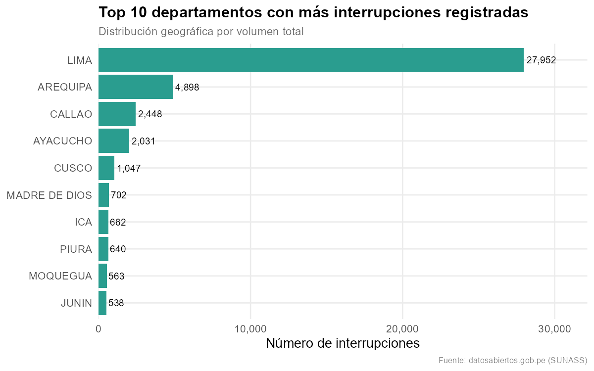
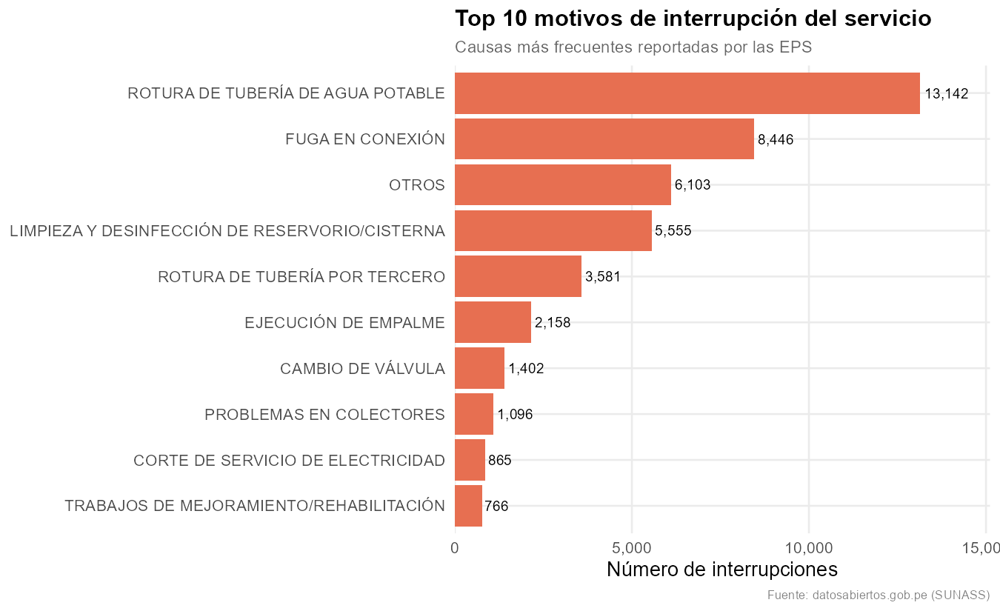
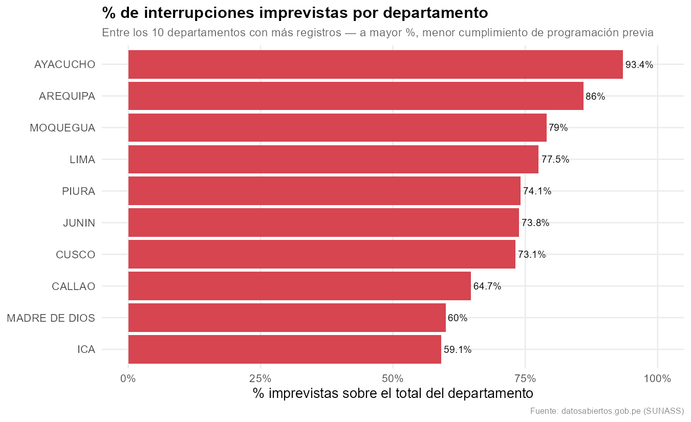
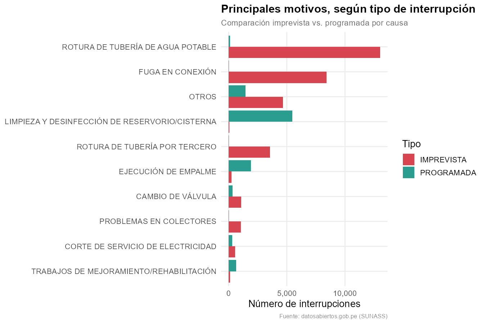

# Análisis de Interrupciones del Servicio de Agua y Alcantarillado (SUNASS)

Trabajo sustitutorio del curso de R — Facultad de Economía, Universidad Nacional del Centro del Perú.

## Fuente de datos
[Registro de interrupciones del servicio de agua y alcantarillado imprevistas y programadas](https://www.datosabiertos.gob.pe/dataset/registro-de-interrupciones-del-servicio-de-agua-y-alcantarillado-imprevistas-y-programadas), reportado por las empresas prestadoras (EPS) a SUNASS. El dataset contiene 45,671 registros con información sobre la empresa prestadora, tipo y motivo de interrupción, fechas y horas de inicio/fin, ubicación geográfica y número de conexiones afectadas.

## Contenido del repositorio
- `data/`: dataset original (`Interrupciones_Dataset.csv`) y dataset limpio (`interrupciones_limpio.csv`).
- `figures/`: los 8 gráficos generados en el análisis.
- `EDA.R`: script completo de importación, limpieza, estadística descriptiva y visualización.

## Metodología
El análisis siguió el flujo de importación → limpieza y creación de variables derivadas (duración de la interrupción, mes de ocurrencia) → estadística descriptiva (variables numéricas, tablas de frecuencia y tablas cruzadas) → visualización. Para el análisis de duración se excluyeron los registros con duración ≤ 0 horas (~45% del dataset, un patrón sistemático presente en casi todas las EPS por igual, probablemente asociado a cómo registran la hora de restablecimiento) y los que superaban los 7 días (0.3%, posibles errores de digitación), ya que distorsionaban la medida sin aportar información confiable.

## Análisis realizado

### 1. Interrupciones por mes (temporal)

Observo que el número de interrupciones registradas muestra una tendencia creciente entre 2020 y 2023, pasando de menos de 300 casos mensuales a más de 1,000. Considero que esto no necesariamente significa que el servicio haya empeorado, sino que es probable que más empresas prestadoras se hayan sumado al reporte a SUNASS con el paso de los años, mejorando la cobertura del registro. Las caídas bruscas al inicio (2019-2020) y al final (2024) del gráfico corresponden a periodos incompletos dentro del dataset.

### 2. Top 10 EPS con más interrupciones

SEDAPAL concentra claramente la mayor cantidad de interrupciones registradas (más de 29,000), muy por encima de las demás EPS. Me parece razonable, ya que SEDAPAL atiende a Lima Metropolitana, la ciudad más poblada del país, por lo que es esperable que también concentre más eventos en términos absolutos, más que un indicador de mala gestión relativa.

### 3. Interrupciones imprevistas vs. programadas

El 76% de las interrupciones registradas a nivel nacional son imprevistas y solo el 24% programadas. Según la normativa de SUNASS mencionada en la consigna del trabajo, las interrupciones deberían ser programadas y comunicadas previamente a los usuarios, así que esta proporción me sugiere que la mayoría de los cortes de servicio ocurren por eventos no controlados por las empresas prestadoras, y no por un incumplimiento sistemático de la norma.

### 4. Duración según tipo de interrupción

Al comparar la duración de ambos tipos, no encuentro una diferencia relevante entre imprevistas y programadas: la mayoría de los registros válidos duran prácticamente 24 horas en ambos casos. Considero que esto es más una limitación del dato que un hallazgo real, ya que sugiere que muchas EPS redondean o estandarizan el tiempo de duración reportado a un día completo, en lugar de registrar la hora exacta de restablecimiento del servicio.

### 5. Interrupciones por departamento (geográfico)

Lima concentra la mayor cantidad de interrupciones en términos absolutos, seguida de Arequipa. Esto va en línea con lo que ya se observó en el gráfico de EPS, dado que ambas regiones tienen alta densidad poblacional y, por lo tanto, mayor volumen de conexiones que pueden verse afectadas.

### 6. Principales motivos de interrupción

La causa más frecuente es la rotura de tubería de agua potable (28.8% del total), seguida de fuga en conexión (18.5%). Me parece que ambas están relacionadas con el estado de la infraestructura de distribución, más que con decisiones de gestión de las empresas prestadoras.

### 7. % de interrupciones imprevistas por departamento

Aunque Lima concentra el mayor número de interrupciones, no es el departamento con mayor proporción de imprevistas: Ayacucho (93.4%) y Arequipa (86%) superan claramente a Lima (77.5%). Interpreto esto como una señal de que, en esas regiones, una proporción mayor de su infraestructura enfrenta fallas no planificadas en comparación con su propia actividad de mantenimiento programado, lo que podría reflejar menor capacidad de mantenimiento preventivo o infraestructura más antigua en esas zonas, aunque no cuento con datos adicionales para confirmar esta hipótesis.

### 8. Motivo según tipo de interrupción

Este gráfico confirma que la naturaleza del motivo determina fuertemente si la interrupción es imprevista o programada: causas como fuga en conexión y rotura de tubería son casi en su totalidad imprevistas, mientras que la limpieza y desinfección de reservorios es casi enteramente programada. Esto tiene sentido para mí, ya que las fallas de infraestructura ocurren de forma repentina, mientras que el mantenimiento preventivo sí puede planificarse con anticipación.

## Conclusiones generales

En términos generales, considero que el problema de las interrupciones del servicio de agua en el Perú está más asociado al estado de la infraestructura de distribución (roturas y fugas) que a un incumplimiento deliberado de la normativa de programación de SUNASS. Lima y Arequipa concentran el mayor volumen de casos por su tamaño poblacional, pero departamentos más pequeños como Ayacucho muestran una proporción más alta de eventos imprevistos, lo que podría señalar diferencias en la calidad o antigüedad de su infraestructura, o en la capacidad de mantenimiento preventivo de sus empresas prestadoras. Una limitación importante que encontré en el dataset es la falta de precisión en el registro de duración de las interrupciones, que en la mayoría de los casos aparece estandarizada a bloques de 24 horas, lo que limita las conclusiones que se pueden extraer sobre el tiempo real que los usuarios permanecen sin servicio.

## Autor
Esteban Reza Brayan Smith — Facultad de Economía, UNCP
